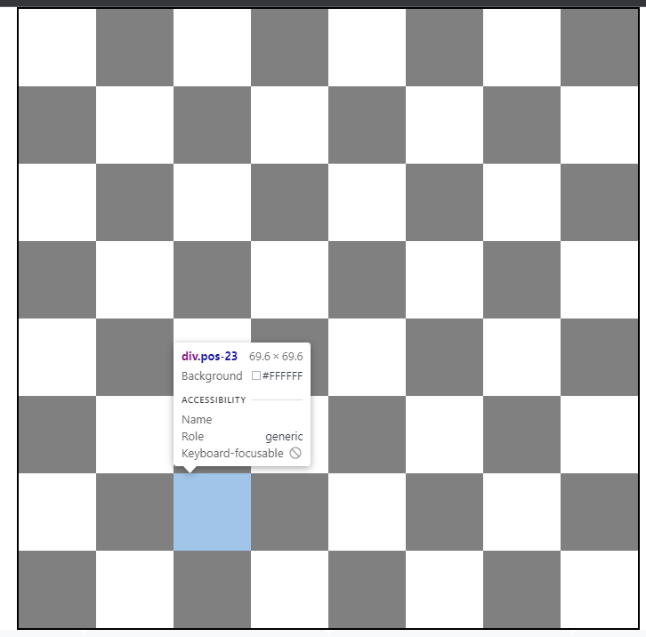
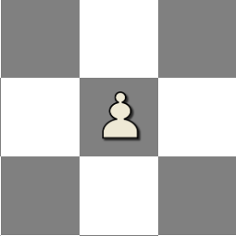
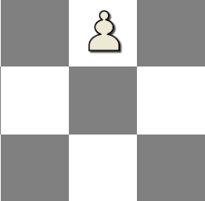
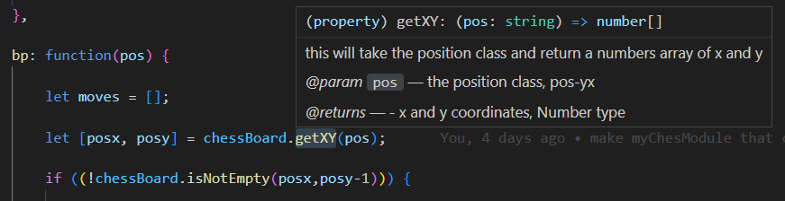
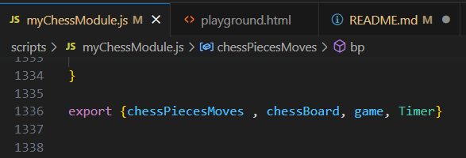
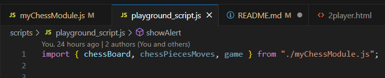

# Project 1

## Technologies used:
- jQuery
- bootstrap


# My Approach

## The chess Board pieces coordinates
this stage was really tricky. figuring out the best way to make the board   
<!--  -->


## moveing the pieces on the board
 
## calculating the moves for each piece

## calculating checks for each side

## 

# New things
## formatted String
you can substitute value of variables in side a string automaticlly. formatted strings saved me a lot of trouple write versatile functions and automation.
```
let name = 'Ahmed'

console.log(`Hello ${name}`) // ---> Hello Ahmed
```
## JSDoc
its used to write documentations for the user defined functions. i tried to use it for every function i wrote to make my life easier when using functions i wrote from a while
```
/**
     * this will take the position class and return a numbers array of x and y 
     * 
     * @param {String} pos      - the position class, pos-yx
     * @returns {Array<number>} - x and y coordinates, Number type
     */
    getXY : function(pos) {
        //console.log(pos);
        let x = Number(pos[5])
        let y = Number(pos[4])
        return [x,y]
    },
```


## Custom Modules
you can write code in one file (module) and reuse it in another script by importing the module.
<br><br>
exporting from the module:<br>
<br><br>
importing in any script:<br>

# Core functions and features
## Genrating the Board
## Pieces classes
## adding and removing pieces
## Switching turns
## checks
## pinning pieces to the king

## the Roll function

## isCheck function


# Future Work
- Adding Animations: like rotating the board after each turn, draging and droping pieces into places.
- adding checkmates.
- adding en passant rule.
- making the styling responsive for smaller screens.
- adding sounds effects for moving and taking pieces, checks and timeouts.


