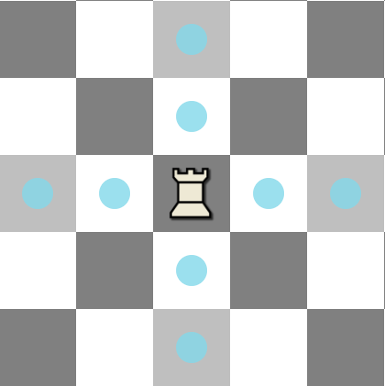
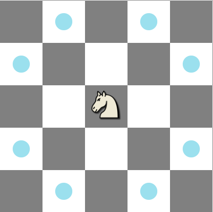
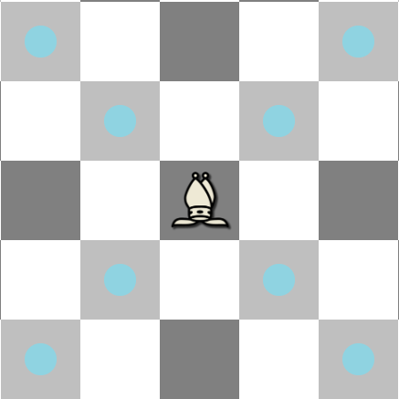
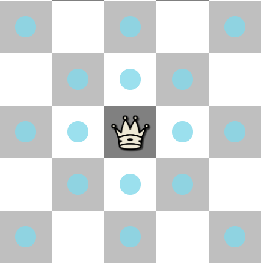
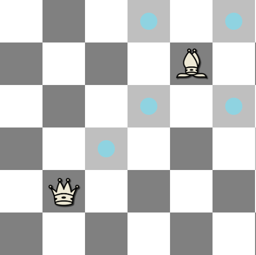
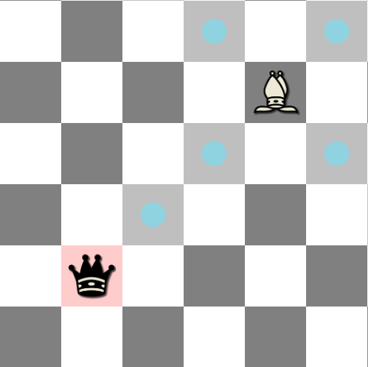
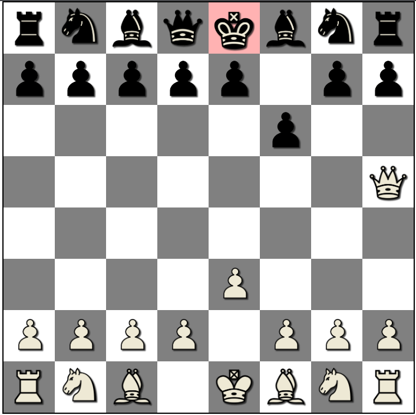
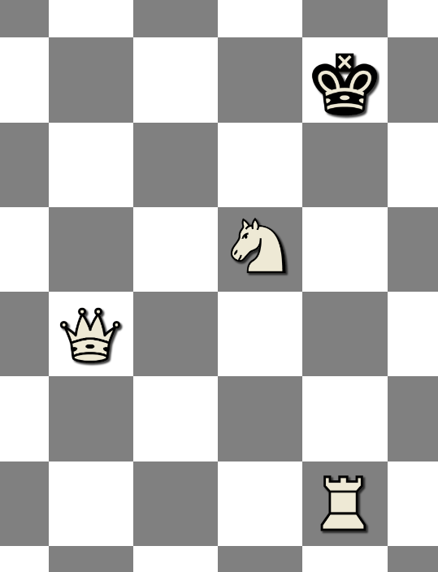

# Project 1

## Technologies used:
- jQuery
- bootstrap
<br><br>

# My Approach

## The chess Board pieces coordinates
this stage was really tricky. figuring out the best way to make the board coordinates easy to use and have an efficient way to move pieces around.<br>
i went with a 8x8 css grid, containing 64 divs generated in js. each div will have a class with the xy coordinates. *pos-{row}{col}* <br><br>
this way i can access any position by the class to add or remove pieces.<br>
<!--  -->
<br><br>

## moveing the pieces on the board
i made a class for each piece, each one has a diffrent background image. to add a piece in any position, i just have to add the piece class to that div class list.<br><br>
If i want to move a piece, i jsut remove the piece class of the old position div and add it in the new positon div:<br><br>
 <br><br>
## calculating the moves for each piece

for the moves i made an object of funtions, with the keys as the pieces classes, so whenever one of the pieces is clicked i just pass the class to the object to get the possible moves of the clicked piece.<br>
to display the moves i made another function. it will check if the position is empty, if so it will display it as a possible move. if the position is not empty and its an opponent piece. it will display it as a possible take.<br><br>

to make my code efficient, i made a versatile function called roll to calculate the moves for the queens, bishops and rooks of both sides.<br>
it will roll in any direction until it finds another piece or the bounds of the board and it will return the positions between them in an array.
<br><br>





<br><br>

## calculating checks for each side


<br><br>


## 

# New things
## formatted String
you can substitute value of variables in side a string automaticlly. formatted strings saved me a lot of trouple write versatile functions and automation.
```
let name = 'Ahmed'

console.log(`Hello ${name}`) // ---> Hello Ahmed
```
## JSDoc
its used to write documentations for the user defined functions. i tried to use it for every function i wrote to make my life easier when using functions i wrote from a while ago. 
```
    /**
     * this will take the position class and return a numbers array of x and y 
     * 
     * @param {String} pos      - the position class, pos-yx
     * @returns {Array<number>} - x and y coordinates, Number type
     */
    getXY : function(pos) {
        //console.log(pos);
        let x = Number(pos[5])
        let y = Number(pos[4])
        return [x,y]
    },
```
<br>when you hover on the function is VS code it will display the docs for the function:<br>


## Custom Modules
you can write code in one file (module) and reuse it in another script by importing the module.
<br><br>
exporting from the module:<br>
<br><br>
importing in any script:<br>

# Core functions and features
## Genrating the Board
```
```
## Pieces classes
```
```
## adding and removing pieces
```
```
## Switching turns
```
```

## checks
```
```
## pinning pieces to the king
```
```
## the Roll function
```
```
## isCheck function
```
```


# Future Work
- Adding Animations: like rotating the board after each turn, draging and droping pieces into places.
- adding checkmates.
- adding en passant rule.
- making the styling responsive for smaller screens.
- adding sounds effects for moving and taking pieces, checks and timeouts.


